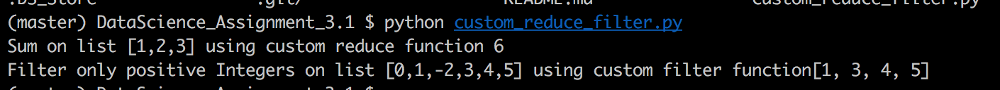

# Problem Statement :
```
#### Problem Statement​ ​1:
 function which works exactly like Python's built-in function reduce()")
#### Problem Statement​ ​2:
 function which works exactly like Python's built-in function filter()")
```

## Snapshot - Custom reduce and filter implementation 




